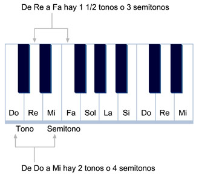
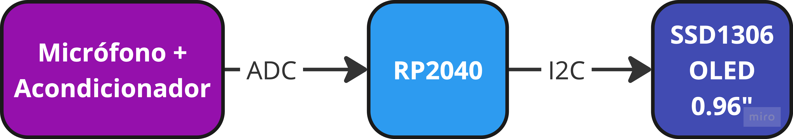
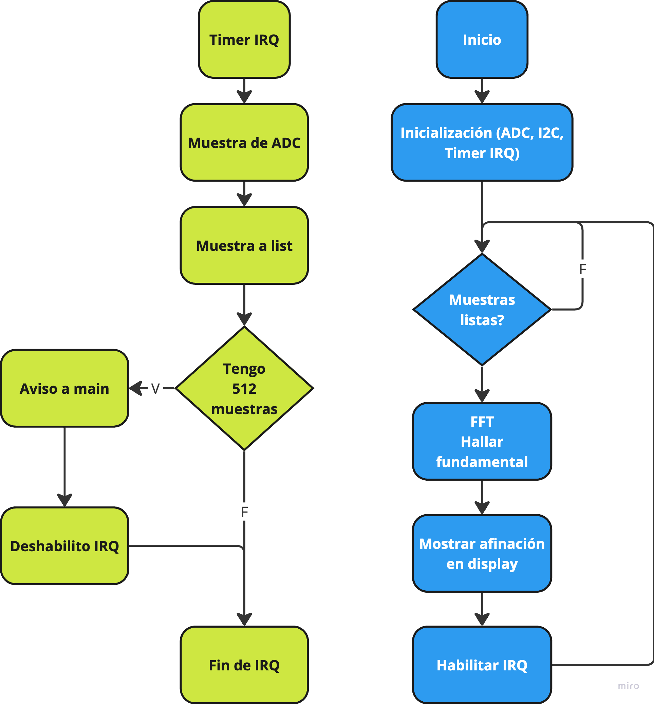

# Afinador de Guitarra con Raspberry Pi Pico (RP2040)

> Desarrollado por [Carlassara Fabrizio](https://github.com/carlassaraf) y [Conde Agustín](https://github.com/aguscondeBBVA).

1. [Introducción](#1-introducción)
2. [Etapa 1](#2-etapa-1) 
    2.1 [Introducción](#21-introducción) 
    2.2 [Desarrollo de etapa 1](#22-desarrollo-de-etapa-1) 
    2.3 [Contenidos teóricos](#23-contenidos-teóricos) 
    2.4 [Mejoras para aplicar en la etapa 2](#24-mejoras-para-aplicar-en-etapa-2) 
    2.5 [Versión de todas las dependencias utilizadas](#25-versión-de-todas-las-dependencias-utilizadas) 
    2.6 [Link a demo](#26-link-a-demo) 
3. [Etapa 2](#3-etapa-2) 
    3.1 [Introducción](#31-introducción) 
    3.2 [Desarrollo de etapa 2](#32-desarrollo-de-etapa-2) 
        &ensp;3.2.1 [Guía de código](#321-guía-de-código) 
        &ensp;3.2.2 [ADC](#322-adc) 
        &ensp;3.2.3 [Timer](#323-timer) 
        &ensp;3.2.4 [FFT](#324-fft) 

## 1. Introducción

El proyecto propuesto consiste en el desarrollo de un afinador de guitarra basado en la plataforma Raspberry Pi Pico (RP2040). Este afinador estará diseñado para detectar la frecuencia fundamental de las cuerdas de la guitarra cuando son tocadas, compararlas con las frecuencias estándar correspondientes a las notas afinadas y mostrar la información en una pequeña pantalla.

El sistema procesa la señal de audio de la cuerda de la guitarra mediante técnicas de análisis de frecuencia, como la Transformada Rápida de Fourier (FFT), lo que permitirá identificar la frecuencia fundamental de la señal y realizar la comparación con los valores de referencia.

## 2. Etapa 1

### 2.1 Introducción

Se desarrollará la idea principal de obtención de frecuencia fundamental de una señal, dicha obtención se intentará realizar por medio de una transformada rápida de fourier.

### 2.2 Desarrollo de etapa 1

Para desarrollar la etapa 1, hará uso de Google Colab, por el hecho de su simpleza y rapidez de ejecución de código. Por medio de la misma realizaremos una prueba en la cual buscaremos la mejor forma de obtener la frecuencia fundamental de una cuerda de guitarra e ignorar las armónicas producidas.

### 2.3 Contenidos teóricos

Teniendo en cuenta que la afinación ideal es 440Hz (un LA4). De allí nos vamos separando para arriba o para abajo según la nota que necesitemos, dicha frecuencia fundamental termina siendo dada por:

$$
f_n = 440 \times 2^{(n-49)/12}
$$

Donde:

* $f_n$ es la frecuencia de la nota n-ésima.
* $n$ es el número de semitonos que separa la nota de referencia (A4) de la nota que se está calculando. El valor de LA (frecuencia establecida de afinación) corresponde $n = 49$.

Y para saber la cantidad de semitonos entre una nota podria guiarme de la siguiente imagen:

Sabiendo eso podemos transpolar a las notas que emite la guitarra sin ser presionadas y sabiendo que LA4 es $n = 49$, podemos empezar a contar hacia abajo los semitonos para obtener el valor de n y a su vez de la ecuación la frecuencia fundamental de cada cuerda:

| Cuerda | Nota | n | Frecuencia [Hz] |
| --- | --- | --- | --- |
| 6 | Mi2 | 20 | 82,41 |
| 5 | La2 | 25 | 110 |
| 4 | Re3 | 30 | 146,83 |
| 3 | Sol3 | 35 | 196 |
| 2 | Si3 | 39 | 246,94 |
| 1 | Mi4 | 44 | 329,63 |

Ya con dichas frecuencias podemos generar un programa para detectar la cercanía a dichas frecuencias y a partir de allí indicar el grado de afinación de la guitarra.

### 2.4 Mejoras para aplicar en etapa 2

Se implementará la lógica de código en un microcontrolador RP2040, analizando en tiempo real el audio por medio de un micrófono, así pudiendo indicarle en tiempo real al usuario el grado de afinación de su instrumento.

### 2.5 Versión de todas las dependencias utilizadas

Las dependencias usadas en Google Colab son:

* librosa 0.10.2.post1
* matplotlib 3.7.1
* numpy 1.26.4
* scipy 1.13.1
* session_info 1.0.0
* IPython 7.34.0
* jupyter_client 6.1.12
* jupyter_core 5.7.2
* notebook 6.5.5
* Python 3.10.12 (main, Sep 11 2024, 15:47:36) [GCC 11.4.0]
* Linux-6.1.85+-x86_64-with-glibc2.35

### 2.6 Link a demo

* [Google Colab](https://colab.research.google.com/drive/1VPid9wHf0V199YetYvphKKMsmZwi2430?authuser=0#scrollTo=sRPn-5YaUFtj)
* [Demo en GitHub](etapa_1/demo_etapa_1.ipynb)

## 3. Etapa 2

### 3.1 Introducción

En esta etapa, se busca que el algoritmo implementado en Google Colab pueda bajarse a un sistema embebido para poder procesar señales reales. El microcontrolador elegido es un RP2040 por Raspberry Pi. Tiene un procesador dual Cortex-M0+ que, si bien no posee unidad de punto flotante para trabajar la matemática compleja que requiere un algoritmo de FFT, compensa por su alta velocidad de clock de 125 MHz y 264 KB de RAM para almacenar una buena cantidad de muestras y minimizar el error en el resultado. La posibilidad del microcontrolador de tener acceso a 2 MB de Flash lo hace además un buen candidato para un programa en Micropython y que la transición de la etapa 1 a la 2 sea bastante sencilla de implementar.

### 3.2 Desarrollo de etapa 2

Esta etapa constaría de tres bloques sencillos:

* Un micrófono con un acondicionador de señal para llevar la señal de audio capturada a valores de entre 0 a 3,3V. Para esto, se eligió un módulo que viene integrado con un amplificador MAX9814 y que tiene la opción de elegir algunas ganancias posibles. La salida de este amplificador va a ser capturada por el ADC del sistema embebido.
* El microcontrolador RP2040, que va a usarse en el formato que viene en la placa de desarrollo RP2040-Zero que es pequeña y minimalista.
* Una pantalla OLED de 0,96” por I2C para tener una pequeña interfaz gráfica.

 

    

 

#### 3.2.1 Guía de código

En la siguiente figura se puede ver una pequeña guía de cómo fue implementada la resolución de esta etapa.

 

    

 

A diferencia de la etapa anterior, ahora se está trabajando con datos reales, por lo tanto, es crítico hacer conversiones del ADC de forma periódica para poder asegurar la frecuencia de muestreo.

Por esa razón, se implementa una interrupción por Timer. Dentro del callback para la interrupción, se toma la lectura del ADC y se espera a terminar el muestreo establecido para avisar al programa principal de que hay datos listos para realizar la FFT. Mientras esta se resuelve, la interrupción se detiene para no pisar datos ya tomados.

El segundo bloque de instrucciones (programa principal), se encarga de inicializar los periféricos, interrupción y, cuando los datos estén disponibles, resolver la FFT, hallar la fundamental y mostrar la afinación en el display por I2C.

#### 3.2.2 ADC

El ADC del RP2040 es uno de 12 bits de resolución y es capaz de obtener hasta 500 KS/s por lo que podremos obtener muestras con relativamente bajo error. En cuanto a la frecuencia de muestreo, la propia del ADC es más que suficiente para muestrear audio (por debajo de 20 KHz) y aún más teniendo en cuenta que el espectro de la guitarra no supera los 400 Hz.

Sin embargo, como la frecuencia de muestreo quedará definida por el Timer, no es un factor importante la frecuencia de muestreo del ADC en sí para nuestro caso de trabajo.

#### 3.2.3 Timer

El RP2040 posee un único Timer de 64 bits con una base de tiempo fija de 1 us y es capaz de producir interrupciones periódicas en el orden de los microsegundos. Sin embargo, en este aspecto nos cruzamos con el primer limitante. Si bien el hardware es capaz de trabajar con interrupciones de Timer muy bajas, el tiempo que demora resolver instrucciones de Micropython en el microcontrolador y la aparente falta de soporte desde la API para manejar interrupciones en el orden de los microsegundos hacía imposible trabajar con frecuencias de muestreo de los órdenes de 44,1 KHz que es estándar.

Aún así, debido a que en este caso en concreto de trabajo las frecuencias típicas de una guitarra no superan los 400 Hz, podemos trabajar con una frecuencia de muestreo de 2 KHz (interrupciones cada 500 us) y aún así cumplir con el criterio de Nyquist para muestreo.

#### 3.2.4 FFT

Los algoritmos de FFT normalmente no vienen implementados en el firmware de Micropython de cualquiera de los que están disponibles. Debido a eso, fue necesario compilar un firmware propio incluyendo el paquete de ulab que, entre otras cosas, incluye el paquete de numpy que funciona bastante parecido al numpy de Python para computadoras. Con ese paquete, es posible hacer el trabajo de transformada de Fourier con métodos prácticamente iguales a las usadas en la etapa 1.

El paquete de Micropython mencionado junto con las instrucciones para compilar el firmware para el RP2040 se detallan en este [repositorio](https://github.com/v923z/micropython-ulab).

## 4. Conclusiones

Para la implementación en la etapa 2 en el RP2040 se pudo ver que, a pesar de no tener una unidad de punto flotante en su arquitectura, el error alcanzado fue muy mínimo (menor a un Hz). Este hecho es debido a la posibilidad de tener una buena cantidad de muestras (1024) en relación a la frecuencia de muestreo (2 KHz).

Con esto podemos ver que, si bien es ideal que para hacer procesamiento de señales podamos contar con hardware que posea FPU, las ventajas que ofrece pueden compensarse con un microcontrolador que tenga una memoria RAM suficiente para poder almacenar la cantidad de muestras necesarias para minimizar el error.

Por otro lado, se evaluó el uso de las funciones de Goertzel pero resultó mucho más lento que el algoritmo de FFT por la ausencia de la FPU. 

Adicionalmente resaltamos que de la etapa 1 a la etapa 2 hubo una cierta evolucion de código mas que nada orientando al hardware con el que contábamos (RP2040). Por ejemplo, en la etapa 1 se realizaban ventanas de FFT, mientras que en el microcontrolador (etapa 2), que posee menos recursos que los que podemos contar en Google Colab, dichos calculos de ventanas se evitaron y simplemente buscabamos el máximo y buscábamos dónde se encontraba.